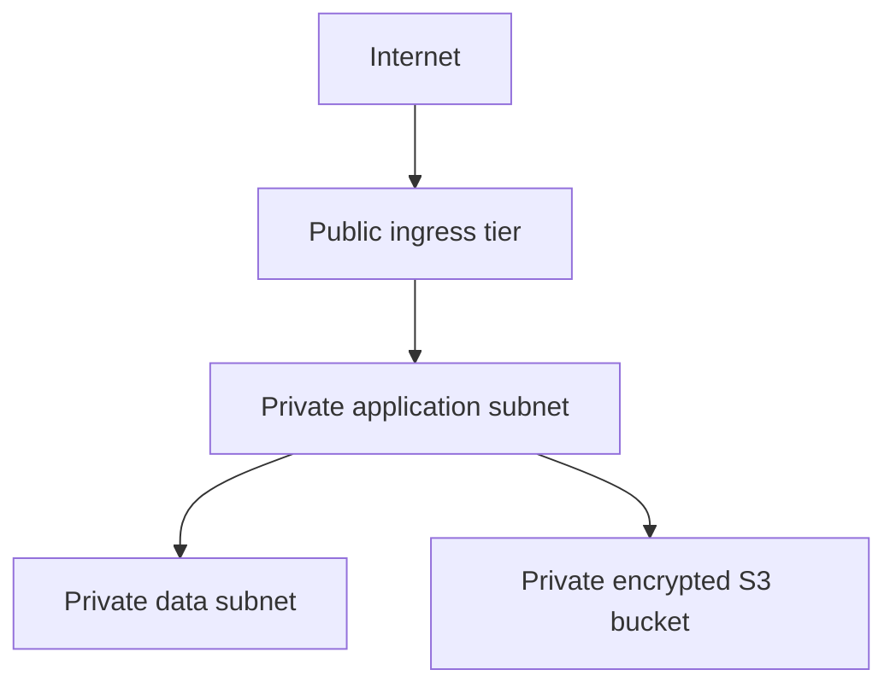

# Architecture

The application and data tiers receive no public IPs. The ingress tier is a conceptual boundary for a future load balancer or WAF; it is not provisioned by this cost-conscious baseline.
